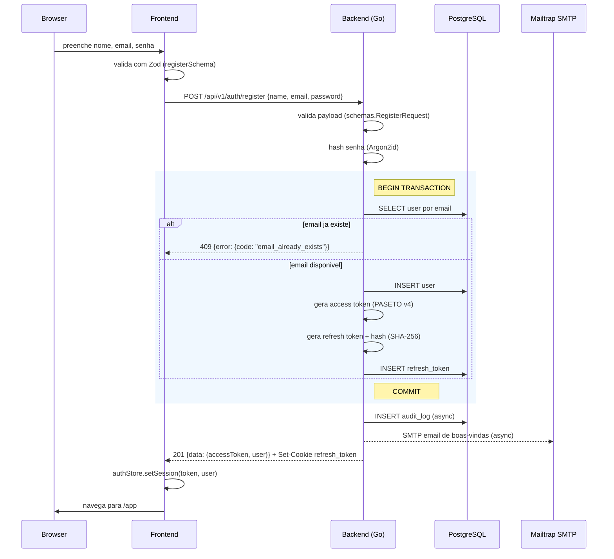
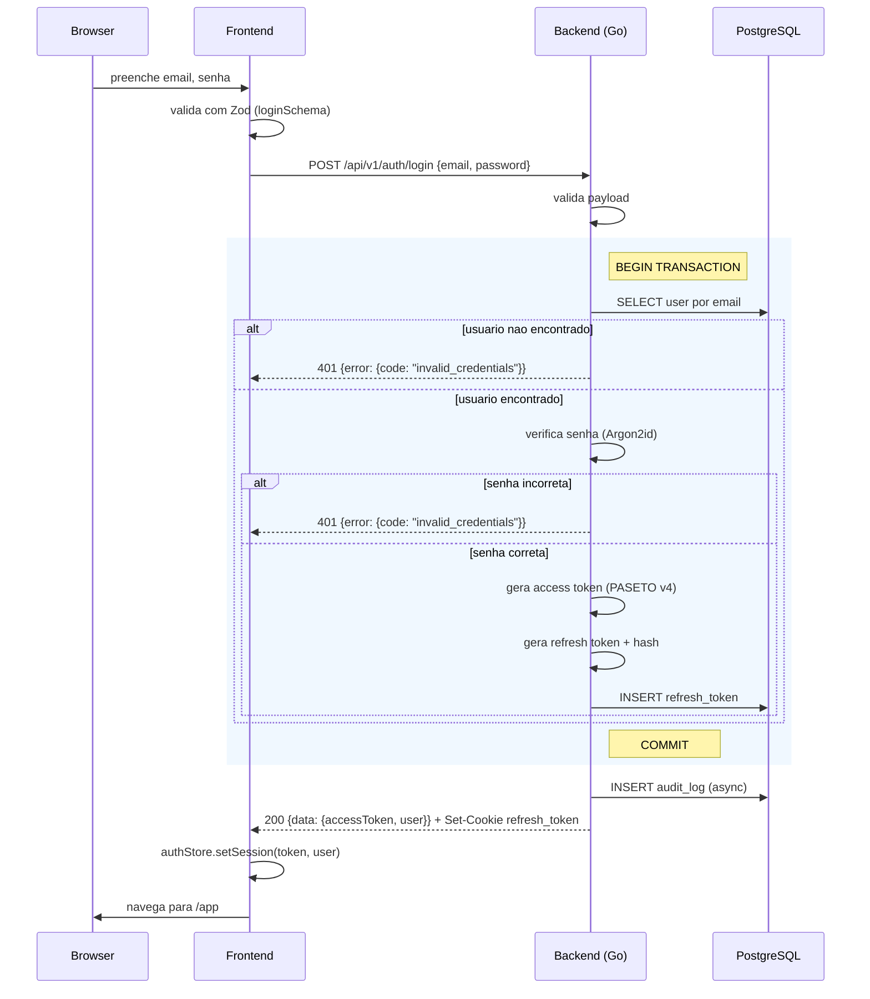
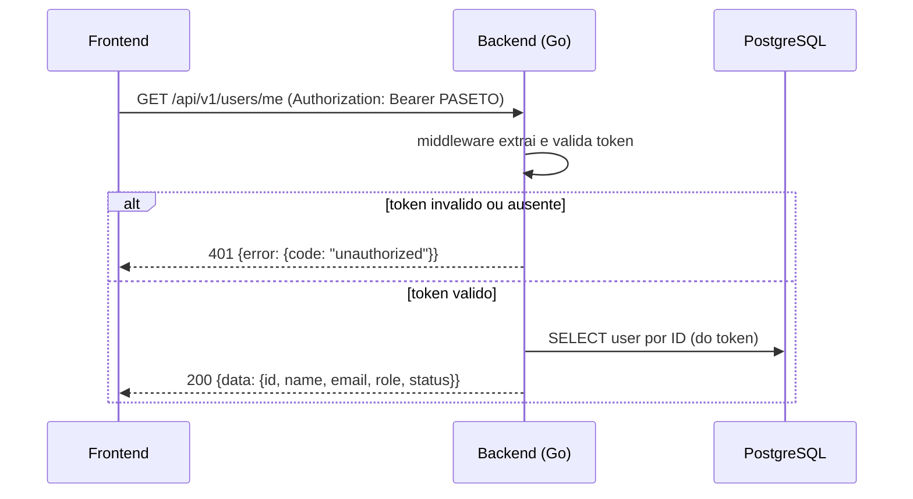
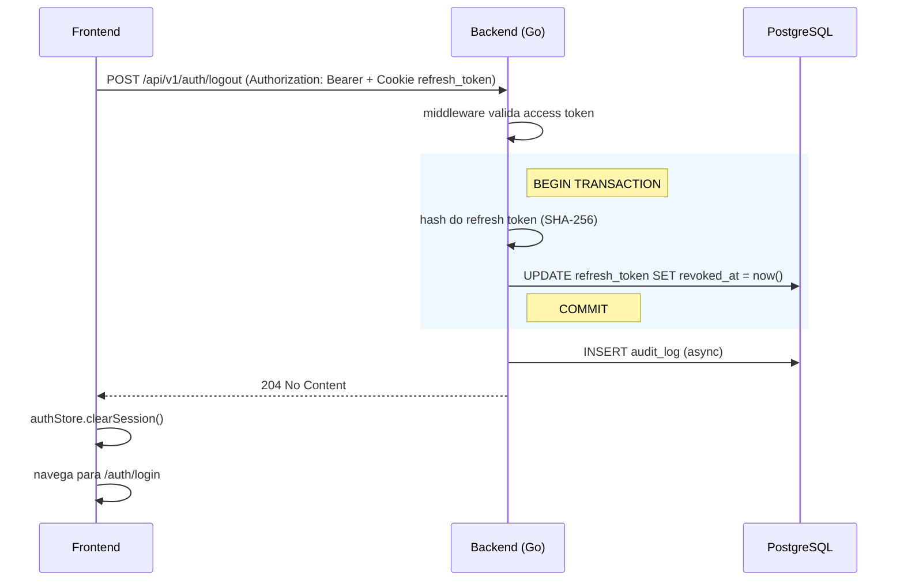

# Fluxo de Autenticacao

Diagramas de sequencia dos endpoints de auth.
Fonte de verdade: `shared/openapi.yaml` e `backends/go-net-http/internal/services/auth_service.go`.

## Register

## Login

## Users/Me

## Logout

