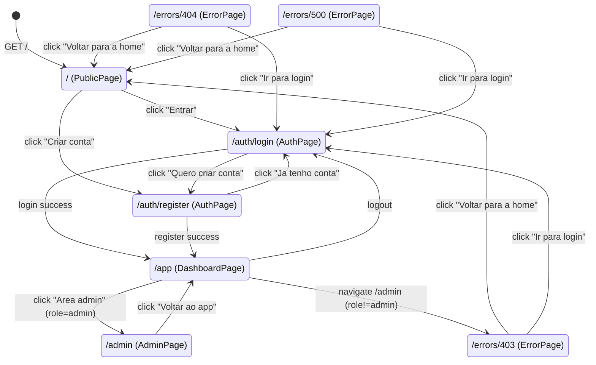

# Navegacao Frontend

State machine da resolucao de rotas no frontend.
Fonte de verdade: `frontends/solidjs/src/utils/router.ts` — funcao `resolveRoute()`.

## Guards

| Rota | Anonimo | role=member | role=admin |
|------|---------|-------------|------------|
| `/` | Public | Public | Public |
| `/auth/login` | Auth | Auth | Auth |
| `/auth/register` | Auth | Auth | Auth |
| `/app` | redirect → `/auth/login` | Private | Private |
| `/admin` | redirect → `/auth/login` | Error 403 | Admin |
| desconhecida | Error 404 | Error 404 | Error 404 |
