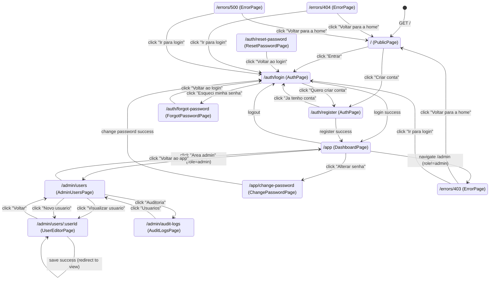

# Navegacao Frontend

State machine da resolucao de rotas no frontend.
Fonte de verdade: `frontends/solidjs/src/router.tsx`.

## Guards

| Rota | Anonimo | role=member | role=admin |
|------|---------|-------------|------------|
| `/` | Public | Public | Public |
| `/auth/login` | Auth | Auth | Auth |
| `/auth/register` | Auth | Auth | Auth |
| `/auth/forgot-password` | Auth | Auth | Auth |
| `/auth/reset-password` | Auth | Auth | Auth |
| `/app` | redirect → `/auth/login` | Private | Private |
| `/app/change-password` | redirect → `/auth/login` | Private | Private |
| `/admin/users` | redirect → `/auth/login` | Error 403 | Admin |
| `/admin/users/:userId` | redirect → `/auth/login` | Error 403 | Admin |
| `/admin/audit-logs` | redirect → `/auth/login` | Error 403 | Admin |
| desconhecida | Error 404 | Error 404 | Error 404 |
